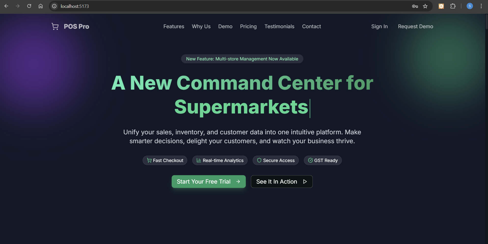

<div align="center">
  
  <h1>🛒 POS Pro System</h1>
  <p>
    A modern, cloud-powered Point-of-Sale (POS) System built for real businesses.  
    Featuring store onboarding, sales billing, inventory tracking, customer management, and business analytics — wrapped in a premium, futuristic UI.
  </p>

  <!-- Live Demo Badge -->

  <a href="https://drive.google.com/file/d/1X2g8AoPVyXCKB0h3g-ojWhJAs8ZHQkmD/view?usp=drive_link" target="_blank">
    
  </a>
</div>

<br />



<hr />

## ✨ Features

POS Pro System combines powerful backend architecture with a delightful UI to streamline store operations.

* 🧾 **POS Billing Terminal** – Fast cart creation, product search, discounts, & bill generation
* 📦 **Real-Time Inventory Management** – Auto-updates stock on every sale
* 👤 **Customer Management** – Add customers, track order history, loyalty support
* 💰 **Sales, Refunds & Shift Summary** – End-of-day reports for accountability
* 🧮 **Store Analytics Dashboard** – Sales graphs, revenue insights, business trends
* 🏪 **Multi-Store Support** – Admin can create/manage multiple stores
* 🔐 **Secure Login with JWT** – Role-based authentication & Spring Security
* 🎨 **Modern UI/UX** – Glassmorphism, animations, dynamic background, dark theme support
* 💳 **Payment Gateway Ready** – Razorpay & Stripe integration support
* 📱 **Fully Responsive** – Designed for desktops, tablets, and POS terminals
* ⚡ **Fast & Scalable** – Spring Boot + React + MySQL ensures high performance

<hr />

## 🛠️ Tech Stack

This project uses a powerful modern stack to deliver a production-grade POS solution.

### **Frontend**

* React (Vite)
* Redux Toolkit
* Tailwind CSS + ShadCN
* Formik & Yup
* React Router
* Custom Animation Engine (Blobs, parallax)

### **Backend**

* Spring Boot
* Spring Data JPA
* Spring Security + JWT
* Hibernate
* Razorpay / Stripe Integration

### **Database**

* MySQL

### **Tools**

* Maven
* Git & GitHub
* VS Code / IntelliJ
* Postman

<hr />

## 📌 Prerequisites

Before running the project:

* **Node.js 18+**
* **npm or pnpm**
* **Java 17**
* **MySQL Server** installed and running

<hr />

## 🚀 Installation & Setup

### 1. **Clone the repository**

```bash
git clone [https://github.com/Paul-110/Java-SaaS-POS-System.git]
cd Java-SaaS-POS-System
```

---

## ⚛️ Frontend Setup (React + Vite)

### 2. Install dependencies

```bash
npm install
```

### 3. Start development server

```bash
npm run dev
```

The app will start at:

```
http://localhost:5173
```

---

## 🖥️ Backend Setup (Spring Boot)

### 4. Configure MySQL

Update your `application.properties`:

```properties
spring.datasource.url=jdbc:mysql://localhost:3306/pospro
spring.datasource.username=root
spring.datasource.password=yourpassword
spring.jpa.hibernate.ddl-auto=update
spring.jpa.show-sql=true
jwt.secret=your_jwt_secret
```

### 5. Run the backend

```bash
mvn spring-boot:run
```

Backend starts at:

```
http://localhost:8080
```

<hr />

## 🎨 Theme Customization

All theme colors, card styling, glassmorphism, & background animations are defined in:

```
/src/index.css
```

Modify values like:

```css
--accent: #1de9b6;
--glass-fill: rgba(15,30,26,0.28);
--background: #061412;
```

hr />

## 🔧 System Modules

Your POS Pro System consists of the following modules:

* Authentication & Security (Spring Security + JWT)
* POS Billing Module
* Order & Refund Management
* Customer Module
* Product & Inventory Module
* Multi-Store Admin Module
* Analytics / Dashboard Module
* Payment Module
* Super Admin & Subscription Plans

<hr />

## 🧩 Architecture Overview

```
Frontend (React + Redux)
       ↓
REST API Layer (Spring Boot)
       ↓
Business Services (Orders, Inventory, Customers)
       ↓
Database (MySQL)
       ↓
Analytics Engine + Reports
```

<hr />

## 📊 Screenshots

> Add your screenshots here:

```
./src/assets/images/Signin.png  
./src/assets/images/super-admin.png  
./src/assets/images/store-admin.png  
./src/assets/images/branch-manager.png  
./src/assets/images/cashier.png  
```

Use Markdown:

```md

```

<hr />

## 🚀 Deployment

### **Vercel (Frontend)**

Just connect your GitHub repo → Vercel auto-detects Vite.

### **Render / Railway (Backend)**

Spring Boot JAR deploy ready.

### **MySQL Cloud Options**

* PlanetScale
* AWS RDS
* NeonDB

<hr />

## 🤝 Contributing

Contributions & feature requests are welcome!
Submit issues or forks through the GitHub repository.

<hr />

## 📧 Contact

**Ekky Spurgeon**
📩 Email: **[spurgeonpaul11@outlook.com](mailto:spurgeonpaul11@outlook.com)**

<hr />

## 📄 License

This project is licensed under the **MIT License** — see the LICENSE file for details.
